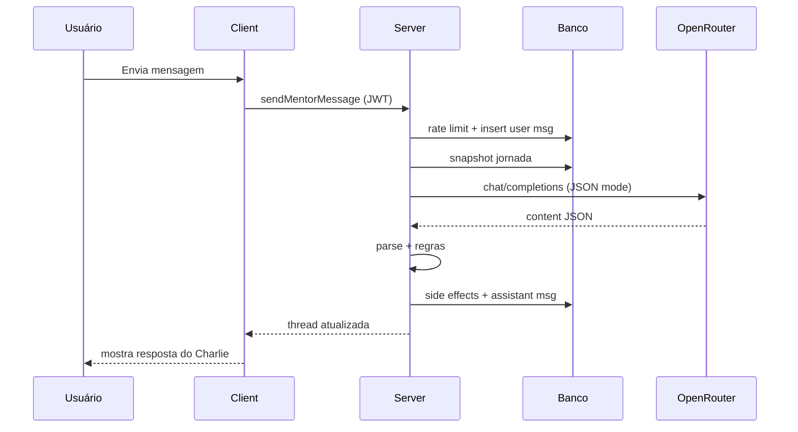

# 03 — Turno de conversa (ponta a ponta)

Este é o coração do método. Uma mensagem do herói percorre este pipeline.

```
UI /mentor
  → sendMentorMessage({ content })
    → auth JWT
    → rate limit (ex.: 20/h)
    → (opcional) fechar pergunta estruturada pendente → memória
    → INSERT mentor_messages (role=user)
    → carregar histórico recente
    → callMentor()
         → snapshot da jornada (DB)
         → system prompt da personalidade
         → bloco CONTEXTO ATUAL
         → (opcional) cartas de sabedoria
         → chatCompletion(OpenRouter)
         → parse JSON
         → side effects (objetivo, desafio, hábito, memória, pergunta)
         → INSERT mentor_messages (role=assistant + metadata)
    → return { userMsg, assistantMsg, challenge?, … }
  → UI atualiza thread
```

Referência: `src/mentor/functions.ts` (`sendMentorMessage`, `callMentor`).

---

## 1. Entrada (client)

O front **não** monta prompt. Só envia o texto (e autenticação).

Pseudo:

```ts
await sendMentorMessage({ data: { content: textoDoUsuario } });
```

---

## 2. Guardas no servidor

| Guarda | Motivo |
| --- | --- |
| Usuário autenticado | Sem JWT → 401 |
| Rate limit | Evita estourar OpenRouter (crítico com free) |
| Conteúdo não vazio | Validação básica |

---

## 3. Persistência da mensagem do usuário

Salva **antes** de chamar a IA. Assim o histórico e a auditoria não dependem do sucesso da OpenRouter.

---

## 4. Montagem do request à LLM

Ordem das mensagens enviadas à OpenRouter:

1. **system** — persona + protocolo (personalidade ativa)  
2. **system** — `CONTEXTO ATUAL DA JORNADA` (+ sabedoria opcional)  
3. **histórico** — últimos turnos user/assistant  
4. **user** — texto deste turno  

Isso é deliberado: o contexto da jornada fica separado da persona, fácil de regenerar a cada request.

---

## 5. Resposta estruturada

A IA deve devolver JSON (ver [04](./04-prompt-contexto-json.md)):

- `message` — o que o herói lê  
- `memory` / `memory_importance`  
- `question`  
- `objective`  
- `challenge` **ou** `habit_suggestion` (nunca os dois)  

O servidor:

1. faz `JSON.parse` defensivo;  
2. valida campos;  
3. aplica regras de negócio (política de desafios, limite de hábitos, etc.);  
4. só então grava no banco.

**Nunca** confie cegamente no JSON do modelo para IDs, XP abusivo, etc. — o servidor é a fonte da verdade.

---

## 6. Side effects típicos

| Campo JSON | Efeito |
| --- | --- |
| `message` | Vira bolha do assistente |
| `memory` | INSERT em memórias (+ prune das menos importantes) |
| `objective` | Upsert do objetivo ativo do mentor |
| `challenge` | Cria desafio com prazo + notificação |
| `habit_suggestion` | Fica pendente até o herói aceitar/recusar na UI |
| `question` | Metadata na mensagem; UI mostra opções |

---

## 7. Presença (sem o usuário digitar)

Ao abrir `/mentor`, `ensureMentorPresence` pode:

1. detectar se é manhã / noite / retorno / welcome;  
2. chamar o **mesmo** `callMentor` com um `userText` sintético;  
3. salvar como `kind` diferente (`morning`, `evening`…).  

Útil para o amigo: “proatividade” = mesmo pipeline, trigger diferente.

---

## 8. Diagrama de sequência (resumido)



---

## O que copiar no outro app (MVP)

Mínimo viável do método:

1. Endpoint autenticado `POST /mentor/chat`  
2. Salvar user msg  
3. Montar 2 systems + history + user  
4. Proxy OpenRouter (`openrouter/free` ok para protótipo)  
5. Parse JSON `{ message, memory? }`  
6. Salvar assistant msg  

Depois acrescente: desafios, hábitos, memórias, presença, personalidades.
