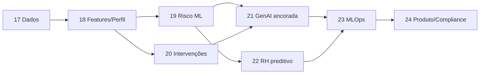

# TODO — Motor de Inteligência Emocional (ML + IA Generativa)

> Roadmap para evoluir o Mundo Mental Care de **chat inteligente reativo** para **companion emocional proativo**.
>
> Base atual (já entregue nas Fases 4–14): chat LLM, check-ins, hábitos, timeline, dashboard emocional, insights por LLM, preventiva por regras heurísticas, plano de cuidado, dashboard RH agregado.
>
> Status: **Planejado — bloqueado** até os Blocos 1–2 de `todo/TODO-PRIORIDADES-PRODUCAO.md` (isolamento por empresa + auth).
> Última atualização: 2026-08-17

---

## Visão

| IA Generativa | Machine Learning |
|---|---|
| Conversa com o usuário | Aprende padrões do usuário |
| Gera respostas e explicações | Faz previsões com probabilidade |
| Atua no momento | Detecta riscos antes de acontecerem |
| Memória de conversas | Melhora continuamente com novos dados |

**Diferencial competitivo:** não é “um chatbot melhor”. É um **Motor de Inteligência Emocional** que aprende continuamente com check-ins, humor, sono, hidratação, exercício, conversas, latência de resposta, frequência de uso, evolução do plano e efetividade das intervenções — e alimenta a IA generativa com sinais preditivos.

```
Dados brutos → Feature Store → Modelos ML → Sinais preditivos
                                              ↓
                         IA Generativa (chat / insights / alertas)
                                              ↓
                         Intervenção → Feedback loop (o que funcionou?)
```

---

## Princípios não negociáveis

1. **Privacidade first** — predições individuais nunca expostas ao RH; RH só vê agregados / tendências por equipe (k-anonimato).
2. **Não diagnóstico** — linguagem de cuidado e tendência, nunca de patologia clínica.
3. **Explicabilidade** — toda predição relevante traz fatores que a sustentam (para o companion; agregados para o RH).
4. **IA gera, ML decide o sinal** — o LLM não “inventa” risco; consome scores/padrões do motor ML.
5. **Cold start gracioso** — com poucos dias de dados, cair para regras atuais; ML só assume protagonismo com volume mínimo.
6. **Human-in-the-loop no RH** — previsões são recomendações de atenção, não automações punitivas.

---

## Estado atual vs. estado alvo

| Capacidade | Hoje | Alvo |
|---|---|---|
| Chat | LLM + últimos 10 turnos + check-in | LLM + memória semântica + **sinais ML** no system prompt |
| Insights | LLM com agregados heurísticos | Insights ancorados em **padrões estatísticos / modelo** |
| Preventiva | Regras (`preventiva-ai.server.ts`) | Modelo de risco + regras como fallback |
| Intervenções | Sugestões genéricas / semi-fixadas | Ranking por **efetividade histórica pessoal** |
| RH | KPIs e alertas por limiar | **Previsão de tendência** por equipe (horizonte 7–14 dias) |
| Memória | Histórico de mensagens | Memória conversacional **+** perfil emocional aprendido |
| Dados | Tabelas operacionais | Feature store + eventos de intervenção + labels |

---

## Fase 17 — Fundação de dados para ML

> Objetivo: tornar os dados existentes treináveis, rastreáveis e seguros.

- [ ] **17.1** Auditar fontes atuais e mapear schema canônico de eventos
  - [ ] 17.1.1 Inventário: `checkins`, `habits`, `diary_entries`, `chat_messages`, `preventive_notifications`, `wellness_plans`, `wellness_checklist`, logs de uso
  - [ ] 17.1.2 Definir contrato de evento único (`user_id`, `ts`, `event_type`, `payload`, `source`)
  - [ ] 17.1.3 Documentar gaps (ex.: hábitos sem série temporal diária completa, falta de “outcome pós-intervenção”)
- [ ] **17.2** Criar tabela `wellness_daily_snapshots` (1 linha/usuário/dia)
  - humor, sono, água, movimento, energia, refeições, check-in feito (bool), msgs chat, hora da 1ª/última interação, streak
- [ ] **17.3** Criar tabela `intervention_events`
  - tipo (respiração, chat, pausa, água, movimento, sons…), origem (chat / alerta / plano / respiro), timestamp, aceita/recusada
- [ ] **17.4** Criar tabela `intervention_outcomes`
  - humor/energia N horas depois, delta vs. baseline, `helped` (implícito ou feedback curto)
- [ ] **17.5** Criar tabela `ml_features` / feature store (ou materialização diária)
  - features de janela 7d / 14d / 30d por usuário
- [ ] **17.6** Criar tabela `ml_predictions` (score, tipo, horizonte, modelo_versão, fatores, expires_at)
- [ ] **17.7** Jobs de backfill: popular snapshots a partir do histórico existente
- [ ] **17.8** Políticas RLS + retenção + anonimização para treino (export sem PII textual quando possível)
- [ ] **17.9** Consentimento / opt-out de personalização preditiva (flag em `profiles`)
- [ ] **17.10** Dashboards internos de qualidade de dados (completude, dias com gap, usuários elegíveis a ML)

**Critério de saída:** ≥ N usuários com ≥ 14 dias de snapshot contínuo; schema ML versionado em migration.

---

## Fase 18 — Feature Engineering & Perfil Emocional

> Objetivo: extrair o “perfil emocional” que o ML vai aprender (exemplo João).

- [ ] **18.1** Features calendário/tempo
  - dia da semana, hora do dia, proximidade de fim de mês / fechamento (quando houver calendário corporativo)
- [ ] **18.2** Features de humor
  - média, volatilidade, sequência de dias negativos, tempo de recuperação após queda
- [ ] **18.3** Features de sono / água / movimento / energia (médias, deltas 3d vs 14d, z-scores pessoais)
- [ ] **18.4** Features de engajamento
  - frequência de check-in, msgs/noite (>22h), latência de resposta no chat, dias sem uso
- [ ] **18.5** Co-ocorrências (gatilhos)
  - pouco sono → ansiedade; pouca água → irritabilidade; muitas horas de chat noturno → humor ↓
- [ ] **18.6** Persistência do `emotional_profile` por usuário (resumo estruturado + última atualização)
- [ ] **18.7** API interna `getEmotionalProfile(userId)` consumível pelo chat/insights/preventiva
- [ ] **18.8** Testes unitários das features (fixtures com o caso “João 45 dias”)

**Critério de saída:** perfil gerado automaticamente para usuários com ≥ 14 dias; visível em debug admin (não no RH).

---

## Fase 19 — Motor de risco individual (substitui / amplia regras)

> Objetivo: passar de limiares fixos para probabilidade de piora.

- [ ] **19.1** Definir labels de risco (ex.: “humor baixo sustentado em 5 dias”, “queda ≥2 pontos de humor”, desengajamento)
- [ ] **19.2** Baseline v0: regras atuais encapsuladas como `RuleBasedRiskScorer` (compatibilidade)
- [ ] **19.3** Modelo v1 supervisado (começar simples: logistic regression / gradient boosting tabular)
  - input: features 7–14d; output: P(risco em horizonte H=3/5/7 dias)
- [ ] **19.4** Pipeline de treino offline (script Python ou HF Jobs) + versionamento de artefato
- [ ] **19.5** Serving: Edge Function / job diário grava em `ml_predictions`
- [ ] **19.6** Integração em `preventiva-ai.server.ts`: preferir score ML; fallback regras se cold start / baixa confiança
- [ ] **19.7** Explicabilidade: top-K fatores (“sono ↓”, “chat após 22h”, “água ↓”)
- [ ] **19.8** Calibration & thresholds por severidade (low/medium/high) + métricas (AUC, precision@k, false positive rate)
- [ ] **19.9** A/B shadow mode: ML calcula, regras decidem UI por 2 semanas; comparar

**Exemplo de saída do motor:**

```json
{
  "user_id": "...",
  "risk_type": "burnout_early_signs",
  "probability": 0.82,
  "horizon_days": 5,
  "factors": ["mood_monday_low", "sleep_lt_6_before_meetings", "chat_after_22h", "water_drop_under_stress"],
  "model_version": "risk_v1.2"
}
```

**Critério de saída:** alerta preventivo no companion cita padrão + horizonte (sem %).

---

## Fase 20 — Personalização de intervenções (o que funciona para quem)

> Objetivo: parar de sugerir opções aleatórias; recomendar o que historicamente ajudou aquela pessoa.

- [ ] **20.1** Taxonomia de intervenções alinhada ao app (respiração, chat, água, movimento, sons, checklist do plano…)
- [ ] **20.2** Instrumentar aceite/recusa e outcome (Fase 17.3–17.4) em todas as superfícies
- [ ] **20.3** Modelo de ranking contextual (multi-armed bandit contextual ou ranker simples por taxa de sucesso pessoal + global)
- [ ] **20.4** Serviço `recommendIntervention(userId, context)` → top 1–3 ações
- [ ] **20.5** Chat e alertas consomem o ranking (não lista fixa)
- [ ] **20.6** Exploração controlada (ε-greedy) para descobrir novas opções sem degradar UX
- [ ] **20.7** Painel companion sutil: “O que costuma te ajudar” (opcional, opt-in)
- [ ] **20.8** Métricas: uplift de humor pós-intervenção vs. baseline; taxa de aceite

**Critério de saída:** após 3–4 semanas de uso, ≥60% das sugestões vêm do ranker pessoal (quando houver histórico).

---

## Fase 21 — IA Generativa ancorada em sinais ML (não só memória)

> Objetivo: o LLM explica e age; o ML fornece o “porquê preditivo”.

- [ ] **21.1** Estender system prompt do chat (`chat-ai.server.ts`) com bloco `ml_signals` (risco, fatores, intervenção recomendada, perfil resumido)
- [ ] **21.2** Guardrails de prompt: proibir inventar % ou diagnósticos; só usar números/sinais injetados
- [ ] **21.3** Separar claramente:
  - **Memória conversacional** — “você comentou da apresentação”
  - **Padrão ML** — “antes de apresentações seu humor costuma cair 2 dias antes”
- [ ] **21.4** Memória semântica (embeddings de trechos relevantes do diário/chat) em tabela `memory_embeddings` + retrieval top-k
- [ ] **21.5** Insights (`insights-ai.server.ts`) passam a receber features/co-ocorrências reais, não só agregados
- [ ] **21.6** Tom preventivo padrão quando `probability ≥ threshold` (“vamos agir antes que isso piore?”)
- [ ] **21.7** Avaliação qualitativa (rubrica): empatia, especificidade, ausência de alarmismo, aderência aos sinais
- [ ] **21.8** Telemetria: quando o usuário marca “fez sentido” / “não fez sentido” no insight/alerta

**Critério de saída:** resposta do companion muda de genérica (“você parece cansado”) para ancorada em padrão pessoal.

---

## Fase 22 — Previsão para o RH (agregado)

> Objetivo: RH deixa de ver só “humor baixo hoje” e passa a ver tendência futura por equipe.

- [ ] **22.1** Agregar features por `team_id` / departamento (mínimo K usuários ativos)
- [ ] **22.2** Modelo de tendência de estresse / humor negativo (horizonte 7–14 dias)
- [ ] **22.3** Cards no `/manager/rh-dashboard`: “Tendência de aumento de estresse — Financeiro — próximas 2 semanas”
- [ ] **22.4** Explicação agregada (sem indivíduo): sono médio ↓, adesão check-in ↓, etc.
- [ ] **22.5** Alertas configuráveis (`alert_configs`) por probabilidade agregada + k-anonimato
- [ ] **22.6** Export de relatório preditivo (PDF/CSV) no portal admin / manager
- [ ] **22.7** Auditoria: quem viu qual previsão, quando
- [ ] **22.8** Política ética documentada em `docs/` (uso permitido / proibido das previsões)

**Critério de saída:** RH recebe ≥1 previsão acionável por equipe elegível, com intervalo de confiança ou faixa qualitativa.

---

## Fase 23 — MLOps, monitoramento e melhoria contínua

> Objetivo: o motor melhora com o tempo sem virar caixa-preta instável.

- [ ] **23.1** Versionamento de modelos + registro (path, métricas, data, dataset hash)
- [ ] **23.2** Retreino periódico (semanal/mensal) com dados novos
- [ ] **23.3** Monitoramento de drift de features e de performance
- [ ] **23.4** Alertas internos se false positives explodirem ou cobertura cair
- [ ] **23.5** Feature flags: `ml_risk_enabled`, `ml_intervention_ranker`, `ml_rh_forecast`
- [ ] **23.6** Ambiente de shadow / canary por empresa
- [ ] **23.7** Runbook de rollback para regras heurísticas
- [ ] **23.8** Custos (inferência LLM vs. batch ML) rastreados no portal admin

**Critério de saída:** retreino documentado + rollback testado em staging.

---

## Fase 24 — Produto, compliance e vantagem competitiva

> Objetivo: empacotar o motor como diferencial comercial da Mundo Mental.

- [ ] **24.1** Copy de produto: “Motor de Inteligência Emocional” (landing interna / proposta comercial)
- [ ] **24.2** Atualizar `docs/POSICIONAMENTO.md` e `docs/PROPOSTA-COMERCIAL.md` com capacidade preditiva
- [ ] **24.3** Checklist LGPD: base legal, minimização, retenção, direitos do titular, DPIA se necessário
- [ ] **24.4** UX de transparência no companion (“Como chegamos nisso?” — fatores, sem jargão)
- [ ] **24.5** Educação do RH: guia de uso responsável das previsões
- [ ] **24.6** Benchmark interno: companion com ML vs. só LLM (retenção, aceite de intervenção, NPS cuidado)
- [ ] **24.7** Demo controlada (persona João 45 dias) para vendas / stakeholders

**Critério de saída:** narrativa comercial alinhada ao que o produto realmente entrega (sem overclaim).

---

## Ordem de execução sugerida



| Prioridade | Fases | Por quê |
|---|---|---|
| **P0** | 17, 18 | Sem dados/features não há ML real |
| **P1** | 19, 21 | Diferencial no companion (cuidado preventivo) |
| **P2** | 20 | Personalização que aumenta retenção |
| **P3** | 22 | Valor B2B para RH / Mundo Mental |
| **P4** | 23, 24 | Escala, confiança e moat comercial |

---

## Stack sugerida (alinhada ao repo)

| Camada | Sugestão | Notas |
|---|---|---|
| App | TanStack Start + Supabase (já existe) | Continua como superfície de UX |
| Feature store / snapshots | Postgres (Supabase) | Migrations em `supabase/migrations/` |
| Treino tabular | Python (pandas + scikit-learn / LightGBM) | Offline; opcional Hugging Face Jobs |
| Serving batch | Cron / Edge Function diária | Grava `ml_predictions` |
| Serving online leve | Leitura de predições + regras | Evitar inferência pesada no request do chat |
| GenAI | OpenRouter / `llm_config` (já existe) | Prompt enriquecido com `ml_signals` |
| Embeddings (memória) | Modelo open via OpenRouter ou HF | Só após Fase 21.4 |
| Observabilidade | `logs.server.ts` + métricas admin | Estender com eventos ML |

> Começar **simples e tabular**. Deep learning só se volume e problema justificarem.

---

## MVP do Motor (primeira fatia entregável)

Escopo mínimo para provar o diferencial (≈ 4–6 semanas de engenharia, dependendo de volume de dados):

1. Snapshots diários + backfill (17.2, 17.7)
2. Features 14d + perfil emocional (18)
3. Risk scorer v1 (mesmo que logistic) + shadow mode (19)
4. Prompt do chat com sinais ML (21.1–21.3, 21.6)
5. 1 card preditivo no RH com k-anonimato (22.1–22.3) — se houver empresas com volume

**Demo João:** dataset sintético ou anonimizado com os 5 padrões do briefing → alerta preventivo + mensagem generativa ancorada.

---

## Definição de pronto (DoD) global

- [ ] Companion age **antes** do pedido de ajuda em ≥1 cenário validado
- [ ] Toda predição individual tem fatores explicáveis
- [ ] RH nunca vê indivíduo em módulos preditivos
- [ ] Cold start não quebra UX (fallback regras)
- [ ] Feature flags permitem desligar ML por empresa
- [ ] Documentação ética + posicionamento atualizados
- [ ] Métricas de aceite de intervenção e falsos positivos acompanhadas por 30 dias

---

## Riscos e mitigações

| Risco | Mitigação |
|---|---|
| Poucos dados / cold start | Regras + priors globais; ML só com N mínimo de dias |
| Falsos positivos alarmistas | Thresholds conservadores; tom de cuidado; dismiss + feedback |
| Vazamento de privacidade no RH | Agregação + k-anonimato + auditoria |
| LLM inventar padrões | Sinais só via `ml_signals`; avaliação automatizada de prompts |
| Overengineering | MVP tabular antes de infra complexa |
| Viés / fairness entre equipes | Monitorar taxas por segmento; evitar uso punitivo |

---

## Checklist rápido de tarefas (backlog executável)

Use esta lista para puxar issues/PRs:

- [ ] Migration: `wellness_daily_snapshots`
- [ ] Migration: `intervention_events` + `intervention_outcomes`
- [ ] Migration: `ml_features` + `ml_predictions` + `emotional_profiles`
- [ ] Job de backfill de snapshots
- [ ] Módulo `src/lib/ml/` (features, risk, ranker, types)
- [ ] Refatorar `preventiva-ai.server.ts` para interface `RiskScorer`
- [ ] Injetar `ml_signals` em `chat-ai.server.ts` e `insights-ai.server.ts`
- [ ] Instrumentar outcomes nas rotas de respiro / chat / plano
- [ ] Card preditivo no RH dashboard
- [ ] Feature flags + opt-out em perfil
- [ ] Script de treino + README em `docs/ml/`
- [ ] Persona demo “João 45 dias”
- [ ] Atualizar proposta comercial com Motor de Inteligência Emocional

---

## Relação com o TODO existente

Este arquivo **continua** o ciclo após `TODO-MundoMental.md` (Fases 0–16).

| Arquivo | Escopo |
|---|---|
| `TODO-MundoMental.md` | Produto companion + manager + admin (entregue em grande parte) |
| `todo/ROADMAP-MOTOR-INTELIGENCIA-EMOCIONAL.md` | Evolução ML + GenAI → Motor de Inteligência Emocional |

Quando uma fase deste roadmap iniciar, marcar o status no topo deste arquivo e abrir subtarefas no board/PR.

---

> **Meta final:** a interface e o chat podem ser copiados; o modelo que aprende continuamente os padrões emocionais dos usuários e melhora recomendações ao longo do tempo cria um **moat** que cresce com a base de dados.
